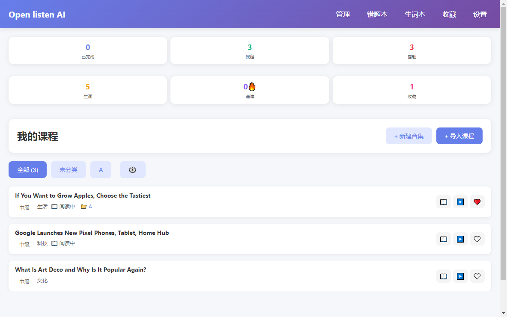
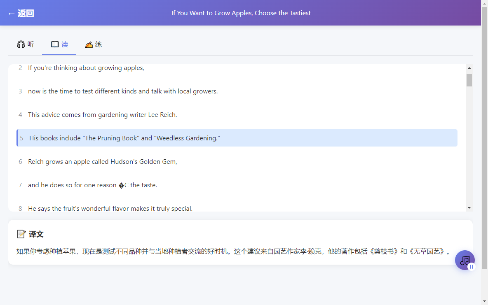
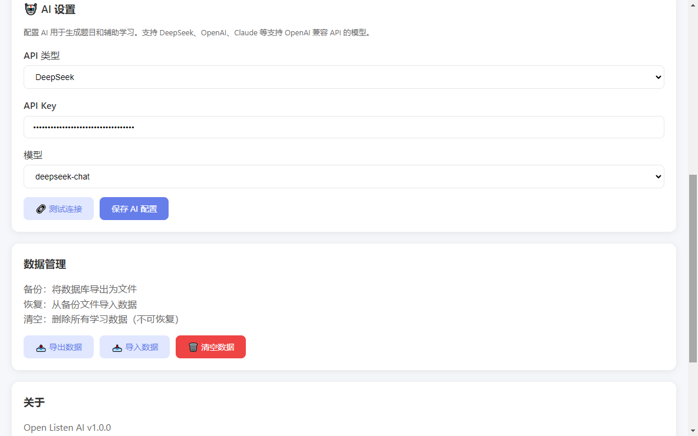
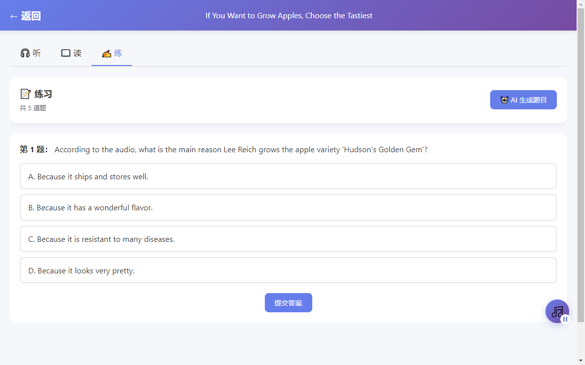

# Open Listen AI (开听)

一款**完全开源免费**的本地语言听读学习工具，基于 Electron + Vue3 开发，支持自定义音频 + 字幕同步播放，打造「听→读→练→记」完整学习闭环。






## 核心特性

- 🎧 **自由导入素材**：支持批量导入文件夹，自动匹配 LRC 字幕和 TXT 翻译
- 📱 **跨平台支持**：Windows、macOS、Linux 桌面端 + Android 移动端
- 📖 **学习模式**：专注模式 + 原文模式，字幕自动跟随滚动
- 🚀 **灵活播放控制**：倍速（0.5x–2.0x）、单句循环、AB 复读
- 📂 **课程管理**：批量移动到合集、批量删除
- 🤖 **AI 辅助学习**：自备 API Key 即可解锁内容总结、自动生成选择题
- 📊 **完整学习闭环**：进度自动保存、学习统计、错题本、生词本
- 💾 **100% 本地运行**：无账号、无云端上传、无广告

## 技术栈

- **核心框架**：Electron + Vue3 + Vite
- **状态管理**：Pinia
- **本地数据库**：SQLite (sql.js)
- **音频播放**：Howler.js
- **移动端**：Capacitor
- **打包工具**：electron-vite + electron-builder

## 快速开始

### 安装依赖

```bash
npm install
```

### 开发模式

```bash
# 启动 Electron 开发
npm run dev
```

### 打包发布

```bash
# 桌面端打包
npm run dist          # 打包所有平台
npm run dist:win      # 仅打包 Windows
npm run dist:mac      # 仅打包 macOS
npm run dist:linux   # 仅打包 Linux

# Android 打包
npm run android:sync    # 构建前端并同步到 Android
npm run android:build   # 打包 Debug APK
npm run android:release # 打包 Release APK
```

APK 输出位置：`android/app/build/outputs/apk/debug/app-debug.apk`

## 项目结构

```
open-listen/
├── src/
│   ├── main/           # Electron 主进程
│   ├── preload/       # 预加载脚本
│   └── renderer/      # Vue3 前端
│       ├── views/     # 页面组件
│       ├── components/# 通用组件
│       ├── assets/    # 样式资源
│       └── router/    # 路由配置
├── android/           # Android 原生项目
├── dist/              # 构建输出
└── package.json       # 项目配置
```

## 数据结构

课程节目 JSON 结构：
```json
{
  "id": "ep001",
  "title": "日常对话 - 购物",
  "difficulty": "elementary",
  "category": "日常对话",
  "audioPath": "/path/to/audio.mp3",
  "transcript": "原文文本内容",
  "translation": "中文译文",
  "lrc": "[00:00.00] Hello World",
  "questions": "[]"
}
```

## 注意事项

1. AI 辅助功能需用户自备 API Key，开发者不提供接口服务
2. 所有学习数据均存储在本地，开发者不收集、不上传任何用户数据
3. 禁止将本项目用于商业侵权场景

## 开源协议

MIT License - 详见 [LICENSE](LICENSE) 文件