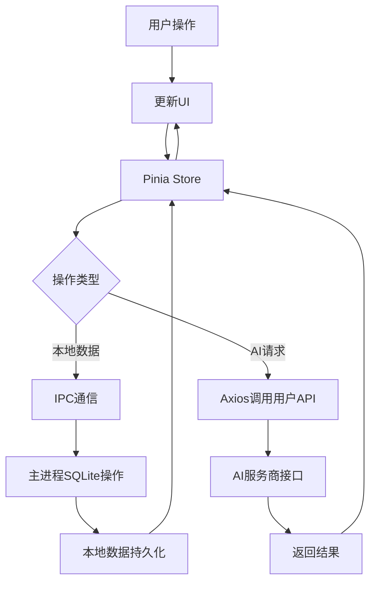

# Open Listen AI（开听）- 语言听读学习 APP
## 项目规划书 v2.0

---

## 一、产品定位

### 1.1 产品概述
- **名称**：Open Listen AI（开听）
- **类型**：跨平台本地语言听读学习工具（PC优先，Android适配，iOS后续支持）
- **技术栈**：Electron + Vue3 + Pinia + SQLite（better-sqlite3）
- **核心定位**：开源免费的本地语言学习工具，支持自定义音频导入，通过用户自备API Key实现AI辅助学习，打造「听→读→练→记」完整闭环
- **核心功能**：
  - 主APP（开源免费）：音频播放、字幕同步、AI总结/出题、学习数据管理
  - 配套工具（付费）：本地离线音频转字幕（Whisper.cpp），用户可以自行寻找替代工具或素材
- **核心优势**：
  - 100%本地运行，无账号、无云端上传、无广告
  - 自由导入任意音频素材，无内容限制
  - AI功能用户自备API Key（适配DeepSeek/GPT/豆包/通义千问等），零运营成本
  - 完整学习闭环：听音频→看原文和AI总结→做练习→记生词→统计进度

### 1.2 目标用户
- 语言学习者（英语为主，可扩展日/韩/西语等）
- 备考雅思/托福/四六级/考研英语人群
- 听力口语提升需求者
- 偏好开源工具、重视隐私的自主学习者
- 有大量自定义音频素材（播客/课程/有声书）的学习者

---

## 二、核心功能流程


---

## 三、功能拆解

### 3.1 核心学习模块（主APP，开源免费，P0=最高优先级）

| 功能 | 描述 | 优先级 | 备注 |
|------|------|--------|------|
| 课程/素材管理 | 新建学习集、按难度/主题分类、批量导入音频+字幕 | P0 | 支持音频与同名字幕自动匹配 |
| 音频播放 | 播放MP3/M4A/WAV/FLAC，进度条、播放/暂停 | P0 | 基于Howler.js实现 |
| 变速播放 | 0.5x/0.75x/1x/1.25x/1.5x/2x | P0 | 语言学习核心需求 |
| 原文/字幕同步 | 加载SRT/LRC/VTT，播放时高亮当前句子 | P0 | 点击句子跳转播放位置 |
| 听力模式 | 盲听练习（隐藏原文） | P0 | 纯听力训练 |
| 单句循环/AB复读 | 重复播放指定句子/段落 | P1 | 强化听力理解 |
| 生词本 | 点击单词显示释义、收藏、标记掌握程度 | P1 | 本地词库，无联网查词（避免API依赖） |
| 跟读模式 | 录音对比原声（基础版） | P2 | 后期迭代功能 |

### 3.2 AI辅助模块（主APP，用户自备API Key）

| 功能 | 描述 | 优先级 | 备注 |
|------|------|--------|------|
| 内容总结 | 基于原文生成学习要点/核心内容 | P1 | 适配OpenAI格式API |
| 选择题生成 | 每篇3-5道单选题/多选题 | P1 | 自动生成解析 |
| 听力填空 | 听写关键句子（AI生成空行） | P2 | 后期迭代 |
| 答案解析 | 答错显示解析、正确答案 | P1 | 本地存储解析内容 |
| 错题重做 | 错题本筛选、重做、标记掌握 | P0 | 核心巩固功能 |

### 3.3 用户数据模块（主APP，本地存储）

| 功能 | 描述 | 优先级 | 备注 |
|------|------|--------|------|
| 学习进度 | 记录每集学习状态（未开始/学习中/已完成） | P0 | SQLite存储 |
| 播放进度 | 记录音频播放位置（秒），断点续听 | P0 | 退出自动保存 |
| 错题集 | 自动收集答错题目、按集/难度筛选 | P0 | 支持批量删除/标记 |
| 收藏功能 | 标记喜欢的音频/句子 | P1 | 本地收藏，无云端 |
| 学习统计 | 连续学习天数、总时长、正确率 | P1 | 可视化图表展示 |
| 历史记录 | 最近学习列表、快速跳转 | P1 | 支持清空 |
| 数据备份/恢复 | 导出/导入SQLite数据库文件 | P1 | 隐私安全保障 |

### 3.4 配套批量工具

| 功能 | 描述 | 优先级 | 备注 |
|------|------|--------|------|
| 本地音频转写 | 离线批量转写音频为文字（Whisper.cpp） | P0 | 支持中/英/日/韩等多语言 |
| 字幕生成 | 自动生成SRT/LRC/VTT，校准时间轴 | P0 | 适配主APP同步规则 |
| 批量处理 | 多文件一次性转写、统一命名 | P0 | 提升素材制作效率 |
| 字幕编辑 | 简单的断句/时间轴调整 | P1 | 基础编辑功能 |

---

## 四、数据结构（适配SQLite本地存储）

```javascript
// 音频/剧集数据（核心）
Episode {
  id: string,          // 唯一标识
  title: string,       // 标题
  difficulty: 'elementary' | 'intermediate' | 'upper' | 'advanced', // 难度
  category: string,    // 分类（日常对话/新闻/课程等）
  audioPath: string,   // 本地音频绝对路径
  transcript: string,  // 原文文本
  translation: string, // 译文（可选）
  lrcContent: string,  // LRC字幕内容（Base64存储）
  createTime: number,  // 创建时间戳
  isCollected: boolean // 是否收藏
}

// 题目数据
Question {
  id: string,
  episodeId: string,   // 关联剧集ID
  type: 'choice' | 'fill', // 题型
  question: string,    // 问题
  options: string[],   // 选项（选择题）
  correctAnswer: string, // 正确答案
  explanation: string, // 解析
  createByAI: boolean  // 是否AI生成
}

// 用户学习进度
UserProgress {
  episodeId: string,
  status: 'not_started' | 'listening' | 'reading' | 'completed', // 状态
  audioPosition: number,  // 音频播放位置（秒）
  lastStudyTime: number,  // 最后学习时间戳
  completedAt: number | null, // 完成时间戳
  studyDuration: number   // 累计学习时长（秒）
}

// 错题记录
WrongAnswer {
  id: string,
  questionId: string,
  episodeId: string,
  userAnswer: string,     // 用户答案
  wrongAt: number,        // 答错时间戳
  reviewCount: number,    // 复习次数
  isMastered: boolean     // 是否掌握
}

// 生词记录
NewWord {
  id: string,
  word: string,           // 单词
  episodeId: string,      // 关联剧集
  paraphrase: string,     // 释义
  addTime: number,        // 添加时间
  reviewCount: number,    // 复习次数
  isMastered: boolean     // 是否掌握
}

// AI配置（用户自备）
AIConfig {
  provider: string,       // 服务商（deepseek/gpt/doubao等）
  apiKey: string,         // API Key（加密存储）
  baseUrl: string,        // 自定义接口地址
  model: string,          // 模型名称
  temperature: number     // 生成温度
}
```

---

## 五、UI/UX 设计（适配PC+移动端）

### 5.1 页面结构（Electron跨端适配）

```
├── 首页（素材列表）
│   ├── 学习集分类/难度筛选
│   ├── 搜索框（标题/分类）
│   ├── 导入音频/字幕按钮
│   └── 最近学习快捷入口
│
├── 学习页面（核心）
│   ├── 顶部：标题 + 难度 + 收藏按钮
│   ├── 音频控制区
│   │   ├── 播放/暂停/上一句/下一句
│   │   ├── 进度条 + 播放时间
│   │   ├── 倍速/循环/盲听模式按钮
│   │   └── 音量调节
│   ├── Tab切换区
│   │   ├── 听：纯听力模式（隐藏文本）
│   │   ├── 读：原文+译文+字幕同步
│   │   └── 练：AI练习题 + 答题反馈
│   └── 底部：生词本/错题本入口 + 完成学习按钮
│
├── 错题本页面
│   ├── 筛选（按集/难度/时间）
│   ├── 错题列表
│   └── 批量重做/标记掌握
│
├── 生词本页面
│   ├── 单词列表（按添加时间/字母排序）
│   ├── 快速复习
│   └── 导出单词本
│
├── 我的页面
│   ├── 学习统计（时长/天数/正确率）
│   ├── 收藏列表
│   ├── 数据备份/恢复
│   └── 设置入口
│
└── 设置页面
    ├── 播放设置（默认倍速/循环模式/锁屏播放）
    ├── AI配置（API Key/服务商/模型）
    ├── 界面设置（主题/字体大小）
    ├── 数据管理（清理缓存/初始化）
    └── 关于（开源协议/配套工具入口）
```

### 5.2 核心交互设计

| 交互场景 | 设计规则 |
|----------|----------|
| 音频控制 | 点击播放/暂停，进度条拖拽跳转，滚轮调节音量 |
| 字幕同步 | 播放时自动高亮当前句子，点击句子跳转对应时间点 |
| 单词查词 | 鼠标悬停/点击单词显示释义弹窗，一键加入生词本 |
| 答题反馈 | 正确→绿色提示+下一题，错误→红色提示+显示解析 |
| 数据操作 | 所有修改自动保存，无需手动点击“保存” |
| API Key配置 | 输入后加密存储，支持测试连通性 |

---

## 六、技术架构（适配Electron+Vue3）

### 6.1 技术选型（核心）

| 层级 | 技术栈 | 选型理由 |
|------|--------|----------|
| 跨端框架 | Electron + Vue3 | 一次开发适配PC/Android，Vue3生态完善 |
| 状态管理 | Pinia | Vue3官方推荐，轻量无嵌套，适配Electron |
| 本地数据库 | SQLite（better-sqlite3） | 轻量、无需服务、本地持久化，性能优异 |
| 音频处理 | Howler.js | 跨平台音频播放，支持进度/循环/变速 |
| 打包工具 | electron-builder | 支持打包exe/dmg/apk，配置简单 |
| UI组件 | Element Plus（PC）+ Vant（移动端） | 分端适配，组件丰富 |
| 加密存储 | crypto-js | 加密API Key/敏感配置，保障隐私 |
| AI接口 | axios | 适配OpenAI格式API，支持自定义BaseURL |

### 6.2 项目结构（规范化）

```
open-listen/
├── src/
│   ├── main/                  # Electron主进程
│   │   ├── index.js           # 窗口/应用生命周期管理
│   │   ├── ipc/               # 主渲染进程通信
│   │   ├── database/          # SQLite初始化/操作
│   │   └── utils/             # 主进程工具（文件操作/加密）
│   ├── preload/               # 预加载脚本（安全通信）
│   │   └── index.js           # 暴露API给渲染进程
│   ├── renderer/              # Vue3渲染进程（前端页面）
│   │   ├── src/
│   │   │   ├── views/         # 页面组件（首页/学习/错题本等）
│   │   │   ├── components/    # 通用组件（播放器/字幕/答题）
│   │   │   ├── stores/        # Pinia状态管理（进度/用户/AI）
│   │   │   ├── utils/         # 前端工具（时间格式化/字幕解析）
│   │   │   ├── api/           # AI接口封装
│   │   │   ├── router/        # Vue路由
│   │   │   └── App.vue/main.js # 入口组件
│   │   └── index.html         # 渲染进程入口
│   └── assets/                # 静态资源（图标/样式）
├── build/                     # 打包配置（electron-builder）
├── public/                    # 公共静态文件
├── .env.development           # 开发环境配置
├── .env.production            # 生产环境配置
└── package.json               # 依赖/脚本配置
```

### 6.3 核心数据流



---

## 七、内容与资源策略

### 7.1 素材来源
- **示例素材**：初期内置10期无版权英文音频+字幕（如公共领域新闻/演讲），避免版权风险
- **用户自定义**：支持用户导入任意音频（MP3/M4A等）+ 字幕（SRT/LRC/VTT）
- **配套工具生成**：批量工具可离线转写音频为字幕，无需依赖外部资源

### 7.2 资源管理
- 音频/字幕文件均由用户本地存储，APP仅记录文件路径，不复制/缓存
- 大文件（如批量工具的Whisper模型）采用“按需下载”模式，减小安装包体积
- 示例素材可选择“在线下载”，不内置到安装包

---

## 八、开发计划（分阶段落地）

### Phase 1: 基础框架
- [ ] Electron + Vue3 项目初始化，规范目录结构
- [ ] SQLite数据库初始化，实现基础CRUD
- [ ] 主进程-渲染进程IPC通信封装
- [ ] 首页/学习页面基础UI搭建

### Phase 2: 核心播放功能
- [ ] Howler.js音频播放/变速/循环功能实现
- [ ] 字幕解析（SRT/LRC/VTT）与同步高亮
- [ ] 音频进度保存/断点续听
- [ ] 听力模式/单句循环功能

### Phase 3: 学习数据管理
- [ ] 生词本/错题本核心逻辑
- [ ] 学习进度/统计数据存储与展示
- [ ] 数据备份/恢复功能
- [ ] 收藏/历史记录功能

### Phase 4: AI辅助功能
- [ ] API Key配置与加密存储
- [ ] AI总结/出题接口封装（适配OpenAI格式）
- [ ] 答题/判分/解析逻辑
- [ ] 错题重做功能

### Phase 5: 配套工具开发
- [ ] Whisper.cpp集成，本地音频转写
- [ ] 批量处理/字幕生成逻辑
- [ ] 付费授权验证机制
- [ ] 工具与主APP的素材互通

### Phase 6: 优化与打包
- [ ] PC/Android端UI适配优化
- [ ] 性能优化（内存/启动速度）
- [ ] 打包测试（exe/dmg/apk）
- [ ] 开源文档/使用教程编写

---

## 九、里程碑与交付物

| 里程碑 | 阶段 | 核心交付物 |
|--------|------|------------|
| M1 | 框架搭建 | 可运行的基础项目，支持音频播放 |
| M2 | 核心功能 | 完整听读流程，本地数据管理 |
| M3 | AI功能 | AI总结/出题，答题闭环 |
| M4 | 配套工具 | 批量转写工具 |
| M5 | 正式发布 | 开源主APP，付费工具上线 |

---

## 十、商业模式与风险控制

### 10.1 商业模式（低风险可持续）
- **主APP**：永久开源免费（MIT协议），GitHub发布，吸引用户基数
- **配套批量工具**：核心盈利点
- **增值服务（可选）**：云端备份（付费）、精选素材库（免费+付费）

### 10.2 核心风险与对策

| 风险类型 | 具体风险 | 应对策略 |
|----------|----------|----------|
| 版权风险 | 音频素材版权问题 | 1. 仅提供工具，不提供核心素材；2. 明确用户协议，禁止侵权使用 |
| 成本风险 | AI接口费用/服务器成本 | 1. AI功能完全由用户自备API Key；2. 全本地运行，无服务器成本 |
| 技术风险 | 跨平台适配问题 | 1. 优先PC端，Android适配简化；2. iOS后续单独适配 |
| 合规风险 | 内容审核/隐私问题 | 1. 所有数据本地存储，不上传；2. 不处理/审核用户内容 |
| 体积风险 | 安装包过大 | 1. 主APP剥离模型，仅几百MB；2. 批量工具模型按需下载 |

---

## 十一、开源与闭源边界
- **开源范围**：主APP全部代码（Electron+Vue3+SQLite核心逻辑）
- **闭源范围**：配套批量工具（Whisper.cpp集成+授权）
- **开源协议**：MIT（允许商用、修改、分发，无开源义务）
- **用户协议**：明确主APP免费、配套工具付费，两者无强制绑定

---

**规划人**：Norie
**日期**：2026-03-22  
**版本**：v2.0
```